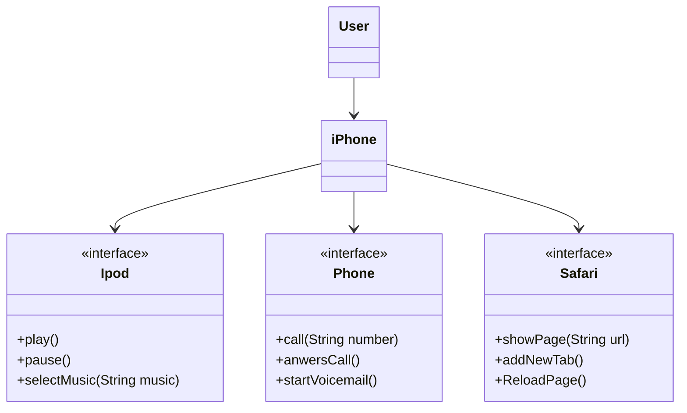

# [DIO](www.dio.me) - Trilha Java Básico

## POO - Desafio

### Modelagem e Diagramação de um Componente iPhone

Neste desafio, você será responsável por modelar e diagramar a representação UML do componente iPhone, abrangendo suas funcionalidades como Reprodutor Musical, Aparelho Telefônico e Navegador na Internet (maiores detalhes no Repositório do desafio : [POO - Desafio](https://github.com/digitalinnovationone/trilha-java-basico/tree/main/desafios/poo) 
).

### Diagrama UML conforme o Desafio:

